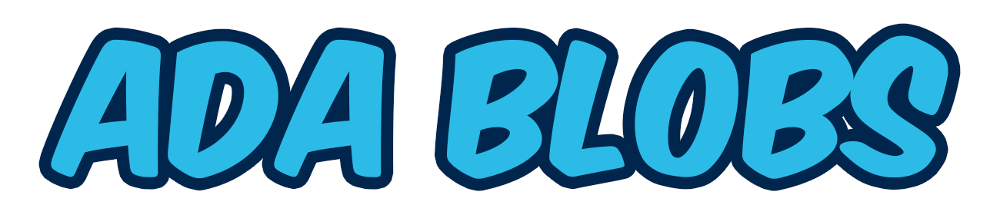

<h1 align="center">
  <a href="https://adablobs.io">
    
    
  </a>
</h1>

<div align="center">
  
  
</div>

Welcome to ADABlobs! The cutest and most adorable NFT collection on Cardano. There are 300 Blob NFTs to collect with 1 new Blob being available each week until all 300 are released. ADA Blobs is the first auction marketplace on the Cardano Blockchain by leveraging Cardano's Plutus Smart Contract capability. This repository contains the full Plutus Smart Contract implementation for ADA Blobs. The repository for the full front end website implementation can be found [here](https://github.com/NicholasMaselli/ADABlobs)

### Community
The Blob Community is strong and growing! Check out our [Discord](https://discord.gg/hxMh4TxeW5) server to hear all the latest updates on the adorable Blobs and connected projects! You can also follow the ADA Blobs [Twitter](https://twitter.com/ADABlobs) for Blob updates as well =)

# A NFT Auction Smart Contract

This repo contains the source for a Plutus NFT auction smart contract. The source for the smart contract is located in `src/Auction/Auction.hs`.

The repo also contains an executable for compiling the smart contract in `app/Main.hs`.

## Building

The compile the code to a Plutus smart contract, run:

```bash
cabal run
```

This will write a file to `scripts/auction.plutus`

A `shell.nix` is also providing for nix users.

## Creating the Script Address

After compiling the smart contract, it is necessary to make a script address.

First source either the testnet or mainnet environment variables.

For testnet

```
$ source scripts/envars/testnet-env.envvars
```

For mainnet

```
$ source scripts/envars/mainnet-env.envvars
```

The environment variable files set `CARDANO_NODE_SOCKET_PATH` to the path of the appropriate Daedalus socket file (either Testnet Daedalus or the regular mainnet Daedalus). It you run a `cardano-node` on your own you should set this environment variable to your socket file location after sourcing the environment variable file.

Next, run:

```bash
scripts/hash-plutus.sh
```

This will make the files `testnet/auction.addr` or `mainnet/auction.addr`.

## Example Transactions

Example transactions can be found in `scripts/core`. The scripts are used by other scripts in `scripts/happy-path` which demonstrates how to start, bid and close the auction.

## Example Redeemers and Datums

Example redeemers are found in `scripts/testnet/redeemers` and example datums are found in `scripts/datums`.


## Full System Testing Prerequistes

Before testing you need to make sure you have `cardano-cli` installed and on your path, and it must be version 1.31.0 or greater. You will also need the json utility `jq` as well as `cardano-cli` helper `cardano-cli-balance-fixer` which can be downloaded here: https://github.com/Canonical-LLC/cardano-cli-balance-fixer

## Init (only done once)

First create the wallets and get the protocol parameters.

```
$ ./scripts/wallets/make-all-wallets.sh
$ ./scripts/query-protocol-parameters.sh
```

# Manual Testing

We will walk through the process of manually testing a start, bid, outbid and close flow.

After following the setup steps above, first make sure that the `~/$BLOCKCHAIN_PREFIX/seller.addr` has Ada.

Start by minting a token for the auction:

```bash
$ scripts/mint-0-policy.sh
```

Wait for the next slot:

```bash
$ scripts/wait/until-next-block.sh
```

You can now view the minted token in the `seller`'s wallet:

```bash
$ scripts/query/seller.sh
```

Now start the auction by calling:

```bash
$ scripts/happy-path/lock-tx.sh 400000 0
```

This will create a auction that expires in 400 seconds. The `0` is namespace so we can have more than one auction going at a time.

Wait for the next slot:

```bash
$ scripts/wait/until-next-block.sh
```

You can now view the token at the smart contract address:

```bash
$ scripts/query/sc.sh
```

Make sure that the `~/$BLOCKCHAIN_PREFIX/seller.addr` has over 11 Ada.

Now create a bid:

```bash
$ scripts/happy-path/bid-1-tx.sh
```

Wait for the next slot, and query the script address

```bash
$ scripts/query/sc.sh
```

It should show the additional 10 Ada bid is now stored there.

Make sure that the `~/$BLOCKCHAIN_PREFIX/buyer1.addr` has over 33 Ada.

Now create a bid, that replaces the first bid:

```bash
$ scripts/happy-path/bid-2-tx.sh
```

Wait for the next slot, and query the script address

```bash
$ scripts/query/sc.sh
```

This should show the new bid's Ada.

Query the `buyer` address:

```bash
$ scripts/query/buyer.sh
```

This should show the old bid Ada has been returned.

At this wait for the auction to expire.

Make sure that the `~/$BLOCKCHAIN_PREFIX/marketplace.addr` has over 3 Ada.

When the time is right, call close:

```bash
$ scripts/happy-path/close-tx.sh
```

Wait for the next slot, and then check that the token is in `buyer1`'s wallet:

```bash
$ scripts/query/buyer-1.sh
```

and the bid is in the sellers wallet:

```bash
$ scripts/query/seller.sh
```

and the marketplace:

```bash
$ scripts/query/marketplace.sh
```
and

```bash
$ scripts/query/royalty.sh
```

# Full System Tests

There are three large system tests that cover the main use cases and potential vulnerabilities we are aware of. The tests can be run on mainnet or testnet.

They take a long time to run, around 20 minutes, and can fail if the testnet is overloaded.

Luckily running them is easy:

```bash
$ ./scripts/tests/all.sh
```

The tests will start running. If the script errors one of the tests has failed.

If the scripts pass one must still verify that assets were transfered correctly at each step.

In the `temp/accounts/diff` directory, there will be subdirectories for each test flow. Within these directories are folders for each test step. If assets were transfer, there will be `json` files the account difference.

For instance after the first step to lock assets at the script address, the following `json` files are written:

```bash
$ cat temp/accounts/diffs/start-bid1-bid2-close.sh/0-1/sc.json
{"":{"":1758582},"d6cfdbedd242056674c0e51ead01785497e3a48afbbb146dc72ee1e2":{"123456":1}}
$ cat temp/accounts/diffs/start-bid1-bid2-close.sh/0-1/seller.json
{"":{"":-1942827},"d6cfdbedd242056674c0e51ead01785497e3a48afbbb146dc72ee1e2":{"123456":-1}}
```

This shows that the smart contract (`sc`), received a non-native token (`d6cfdbedd242056674c0e51ead01785497e3a48afbbb146dc72ee1e2.123456`) and 1758582 lovelaces.

As expected, the seller lost _at least_ this much. Notice it lost more Ada, because of fees.
